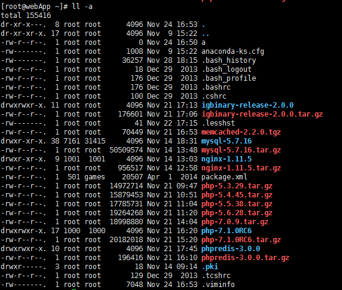

#### 安装centos 
    > 强制使用gpt分区表    初始安装界面的时候 按tab 加入inst.gpt

####文件属性

;

>      # ll -a
>       dr-xr-x---.  8 root root      4096 Nov 24 16:53 .
>       dr-xr-xr-x. 17 root root      4096 Nov  9 15:22 ..
>       -rw-r--r--.  1 root root         0 Nov 24 16:50 a
>       -rw-------.  1 root root      1008 Nov  9 15:22 anaconda-ks.cfg
>       -rw-------.  1 root root     36257 Nov 28 18:15 .bash_history
>       -rw-r--r--.  1 root root        18 Dec 29  2013 .bash_logout

>   第一个字符代表这个文件是目录，文件或链接文件

>      d 为目录  - 则是文件    l为链接  b为块文件  c表示装置文件里面的串行设备，如键盘鼠标

> 2345678910字符代表权限位

> 第二栏表示有多少档名链接到此节点

> 第三栏表示拥有者

> 第四栏表示文件所属群组

> 第五栏为这个文件的容量大小 默认为bytes

> 第六栏为这个文件的建档日期或者最近的修改日期

>     # ls -a --full-time  //显示完整的时间格式

> 第七栏是文档的档名

>     chgrp  /etc/group   改变群组
>     chown  /etc/passwd  改变拥有者
>     chmod  改变权限

>     chmod u,g,o,a    rwx    a

